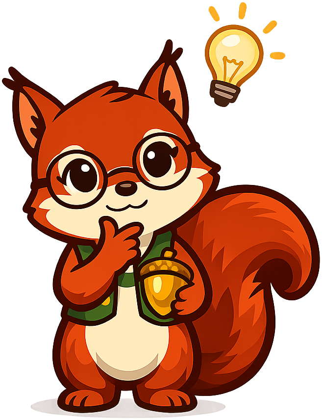

# Mascot Style Guide — Sylvia the Squirrel

This page shows all seven mascot admonition styles for reference. Use it to verify that images load, colors match the book's theme, and the left-floated image layout renders correctly across devices.

!!! mascot-neutral "A Note from Sylvia"
    
    This is the neutral style, used for general sidebars, brief asides, or any content that doesn't call for a specific emotional tone.

!!! mascot-welcome "Welcome!"
    
    A nut saved is a nut earned! This is the welcome style — used at the start of every chapter to introduce the topic and preview what's ahead.

!!! mascot-thinking "Key Insight"
    
    This is the thinking style, used to highlight important financial insights — the "aha moments" you'll want to remember after you close the book.

!!! mascot-tip "Sylvia's Tip"
    
    This is the tip style, used for helpful hints and practical money-saving advice that can make a real difference in your financial life.

!!! mascot-warning "Watch Out!"
    
    This is the warning style, used for common financial mistakes and pitfalls that trip up many savers — things worth slowing down to think about.

!!! mascot-encourage "You've Got This!"
    
    This is the encouraging style, used when a topic feels intimidating. Compound interest, tax forms, loan terms — these take practice, and that's okay.

!!! mascot-celebration "Well Done!"
    
    This is the celebration style, used at the end of chapters or after major milestones. You just added another acorn to your stash!
