# MicroSims for Personal Finance

Here are some example MicroSims you can use in your personal finance class.
You can use these simulations on any course website by just adding a single line of HTML.

Note that many of these charts allow you to hover over a vertical bar to see what was happening that year.

- [Active Investing vs Zero-Fee Passive Indexed Funds](./active-vs-indexed/index.md) 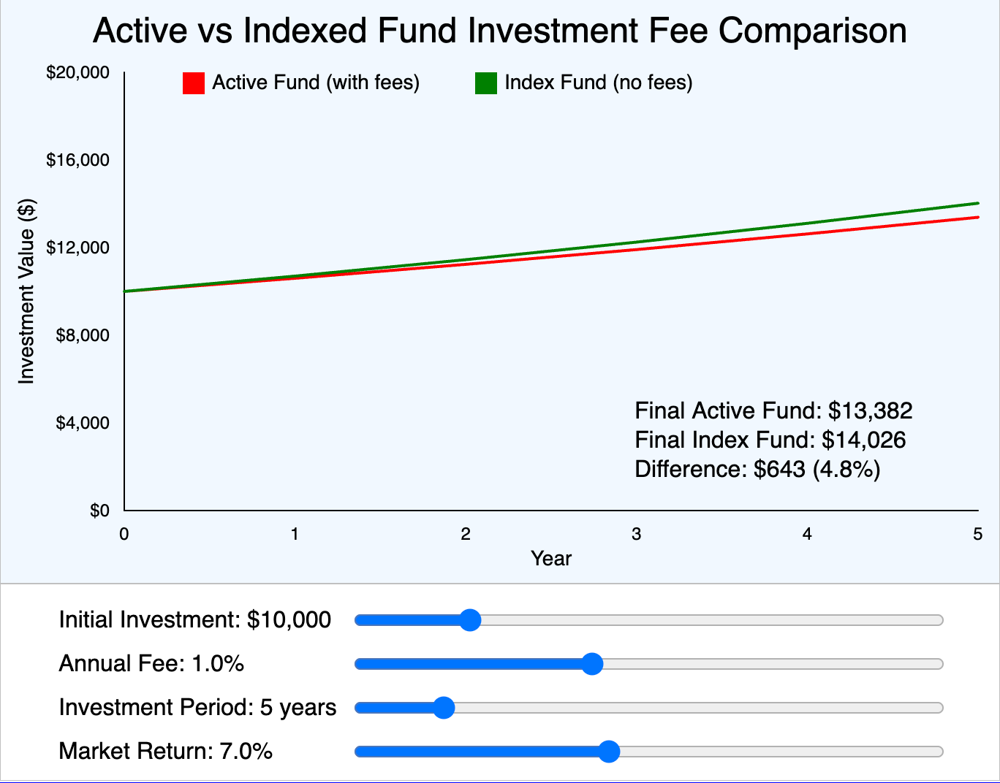
- [College Loan Payback Calculator](./college-loan-payback/index.md) 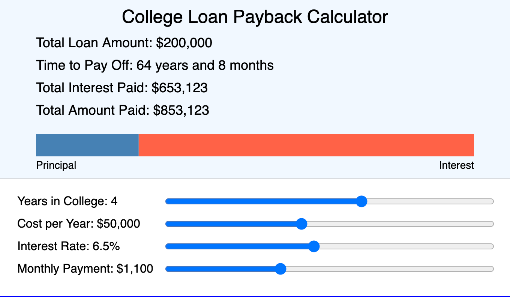
- [Compound Interest Visualizer](./compound-interest-visualizer/index.md) 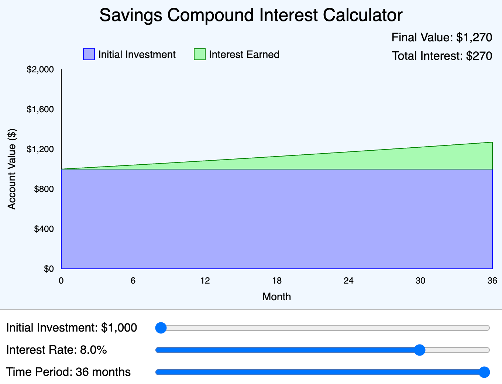
- [FICO Credit Score Spectrum](./fico-score-spectrum/index.md) 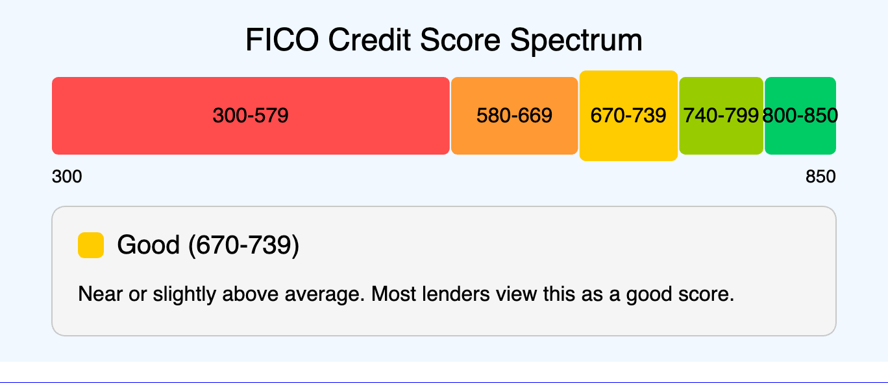
- [Inflation Rates for Past 30 Years](./inflation-rate/index.md) 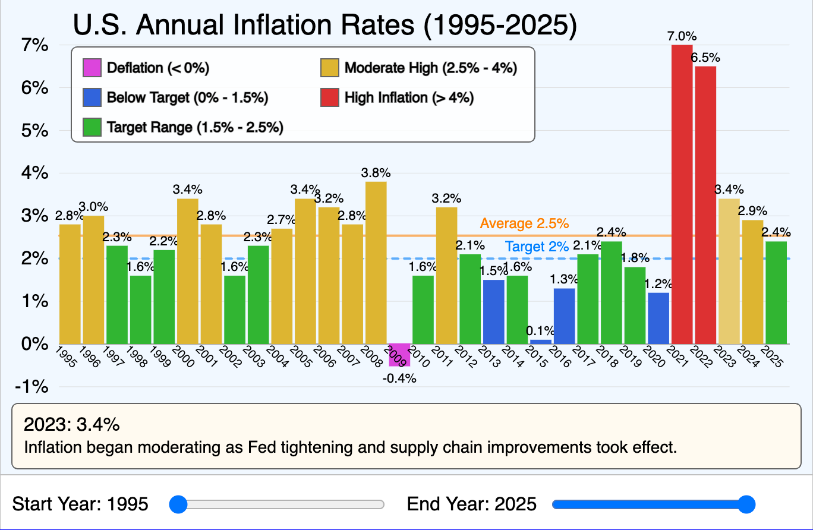
- [Interest Rate for Past 30 Years](./interest-rate/index.md) 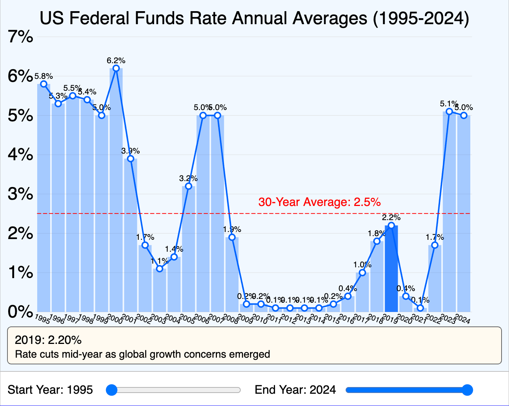
- [Learning Concept Graph](./graph-viewer.html) 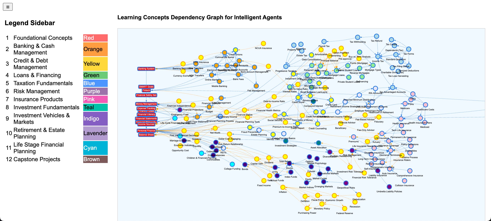
- [Social Security](./social-security-crossover/index.md) 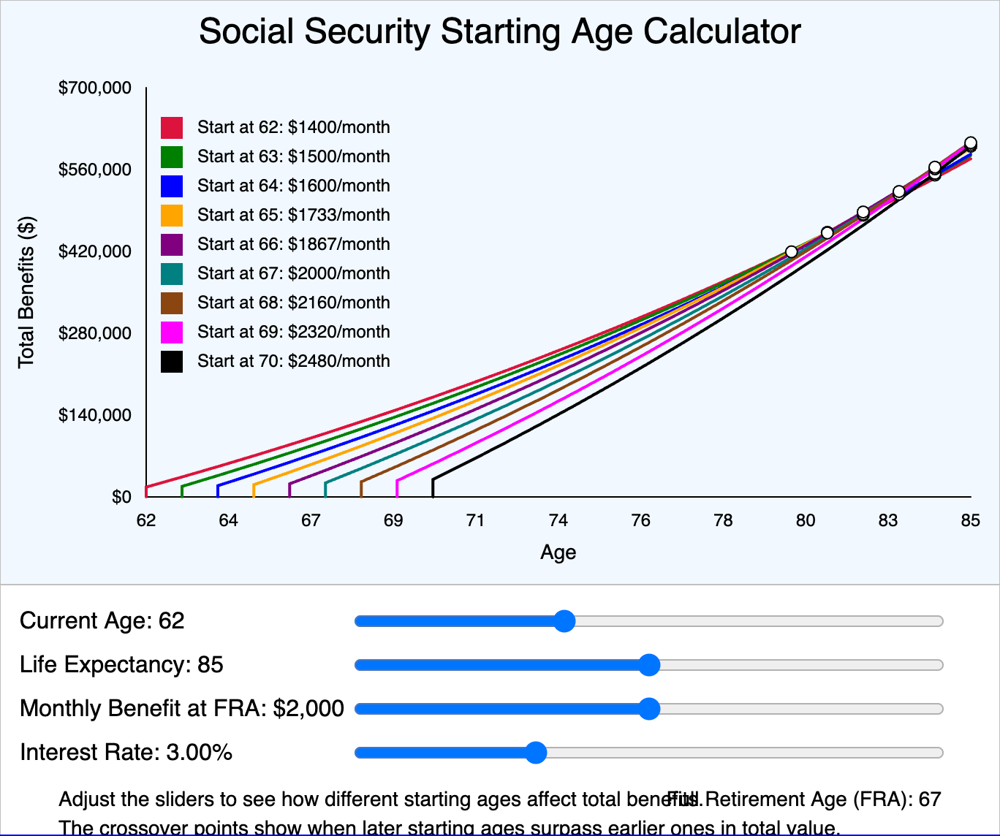
- [Stock Market Returns for Past 30 Years](./stock-market-returns/index.md) 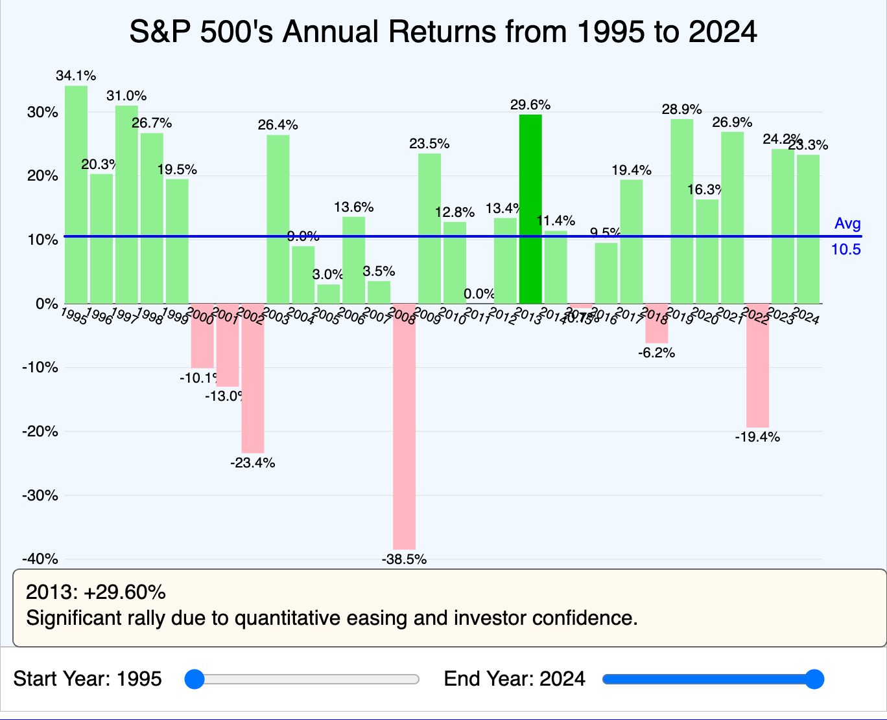
- [US Treasury Bill Rates for Last 30 Years](./t-bills/index.md) 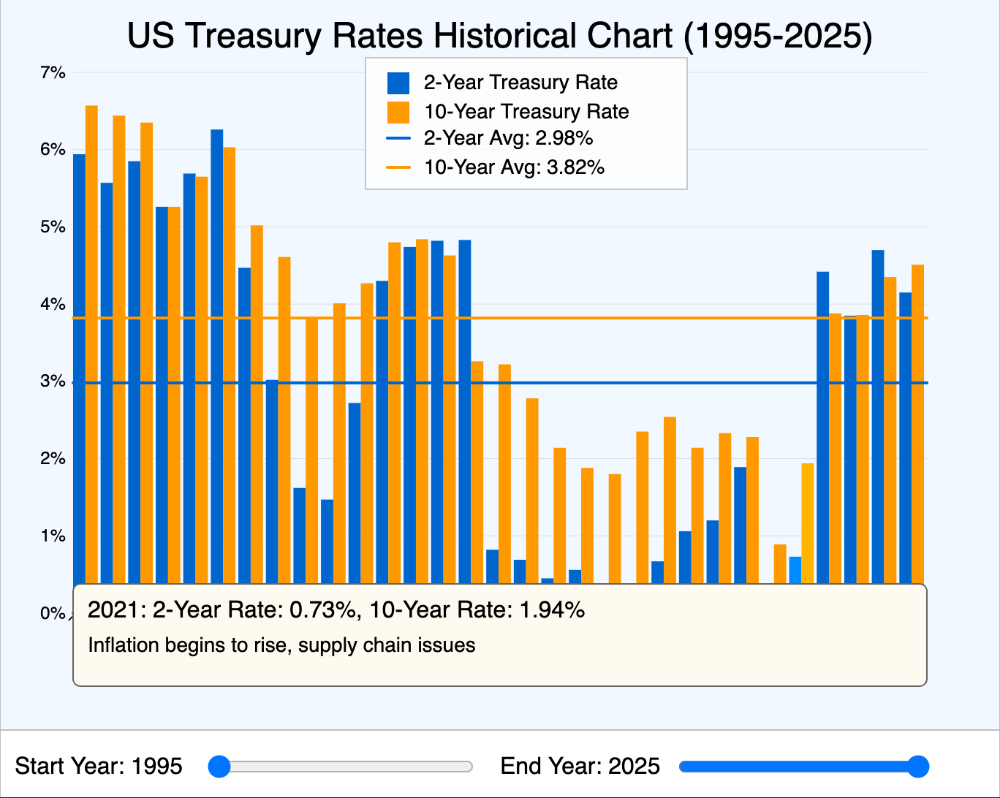
- [US Treasury Bill Yield Curves for Last 30 Years](./yield-curve/index.md) 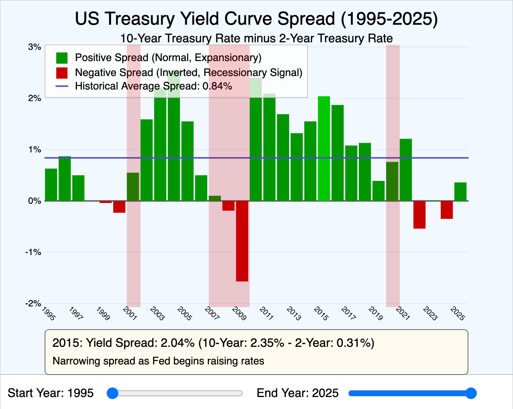

Please let us know if you have other MicroSims you would like to add to your personal finance course.