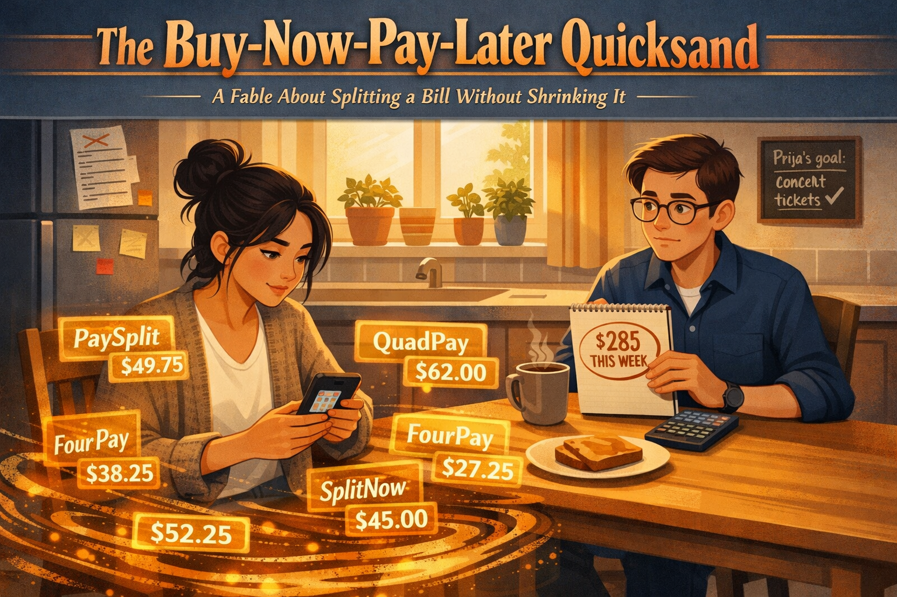
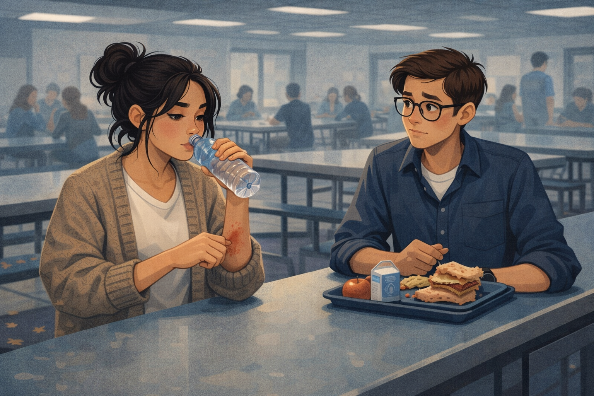
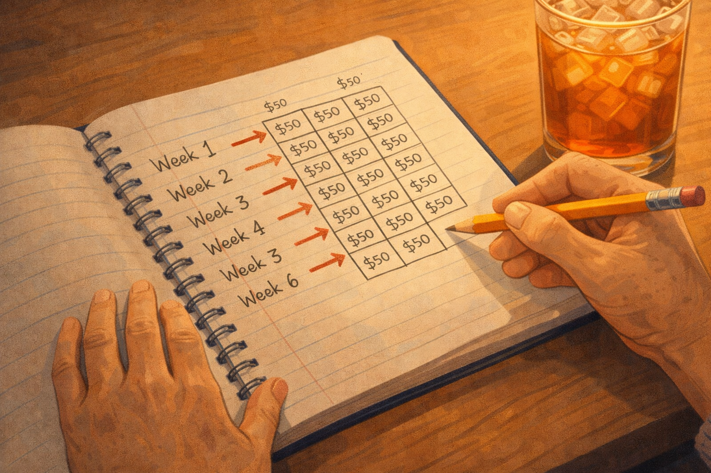
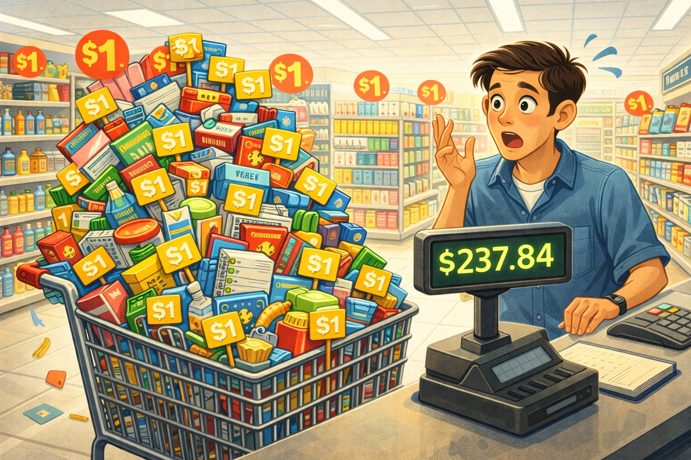

# The Buy-Now-Pay-Later Quicksand: A Tale of Split Payments and Hidden Sums

Cover Image Prompt

At the top of the image, across the top 14% of the canvas, display the title "The Buy-Now-Pay-Later Quicksand" in bold condensed serif typography with a sandy-beige-to-rust-orange gradient fill and a deep charcoal drop shadow. Beneath it, a smaller italic subtitle in cream reads "A Fable About Splitting a Bill Without Shrinking It." Frame the title with a faint horizontal ribbon.

Below the title area, render a 16:9 contemporary illustrated scene in a modern editorial-magazine style with soft shading and clean lines. Foreground: Priya, a seventeen-year-old high school senior with long dark hair pulled into a messy bun and a cozy oatmeal-colored cardigan over a white tee, sits at a light-oak suburban kitchen table. She is ankle-deep in visual quicksand made of glowing translucent phone notifications — each one a separate floating app card labeled "Klarna," "Afterpay," "Affirm," and "PayPal Pay-in-4" — with small white dollar amounts ($49.75, $62.00, $38.25, $27.50, $52.25, $45.00) pulsing on each card. The cards swirl around her legs like syrupy amber water, pulling gently downward. A forgotten plate of toast sits untouched on the table. Her own phone screen shows a calendar where every other day is marked with a small red payment-dot.

Midground: across the table sits Devon, a thoughtful seventeen-year-old in a navy button-down shirt and round glasses, holding a steno notebook and a scientific calculator. He looks concerned, not judgmental, with a steaming mug of tea beside him. His notebook shows a hand-written running total circled twice in red pen: "$285 THIS WEEK."

Background: afternoon light filters through a kitchen window lined with potted basil and rosemary, casting warm rectangles on the tile floor. On the refrigerator, a magnetic shopping list is crossed out line by line. A small chalkboard reads "Priya's goal: concert tickets ✓" with the checkmark growing faintly smaller, as if fading.

Color palette: muted cobalt blues and warm afternoon oranges, translucent gold on the BNPL cards, a single warning-red accent on the calendar dot, cream highlights on the title. Mood: quiet alarm — not panic — a moment of recognition between two close friends. Style: contemporary editorial illustration, flat vector with soft shading and faint paper-grain texture.

Generate the image immediately without asking clarifying questions.

## A New Pair of Sneakers, Four Easy Payments

Devon and Priya had been best friends since sixth grade. They walked home together most days, past the strip mall with the nail salon and the boba shop. Priya loved clothes, skincare, and the tiny thrill of a package showing up on her porch. Devon loved spreadsheets, which is a weird thing to love, but that's who he was.

One Friday in October, Priya was showing off a new pair of sneakers. *"Guess how much,"* she grinned.

*"A hundred?"* Devon asked.

*"Two hundred. But I only paid fifty. Four easy payments through Afterpay. It's basically free."*

Devon didn't say anything. He just wrote "200" in his notebook, next to a little frowny face.

Image Prompt

(This is panel 1. Do not put the panel number in the image.) A 16:9 illustration of two high school students walking past a suburban strip mall in autumn. Priya holds a shoe box and smiles; Devon walks beside her with a small notebook, eyebrows slightly raised. Warm golden-hour lighting, fallen leaves on the sidewalk, a boba shop and nail salon visible in the background. Contemporary editorial illustration style. Generate the image immediately without asking clarifying questions.

## Six Orders, Four Services, One Stress Rash

Over the next month, Priya kept showing up with new things. A skincare set from Sephora, split four ways on Klarna. A winter coat, split four ways on Affirm. A concert ticket, a hair straightener, a dress for homecoming — each one came with its own little payment plan, each one labeled "just $50 every two weeks."

By early November, she was skipping lunch. She'd drink water and say she wasn't hungry. Devon noticed the red patches on her wrists, where she kept scratching at a rash that hadn't been there in September.

*"Are you okay?"* he asked, one Wednesday in the cafeteria.

Priya's voice was small. *"I think I messed up. I don't know how much I owe. I just know my debit card keeps getting declined and my mom doesn't know yet."*

Image Prompt

(This is panel 2. Do not put the panel number in the image.) A 16:9 illustration of a high school cafeteria. Priya sits at a long table without a lunch tray, drinking water from a bottle, scratching absently at a red rash on her wrist. Devon sits across from her, looking concerned, his own lunch half-eaten. Fluorescent overhead lighting, blue and gray tones, other students blurred in the background. The mood is quiet worry. Contemporary editorial illustration style. Generate the image immediately without asking clarifying questions.

## The Skeptical Question

Devon opened a blank page in his notebook. *"Okay,"* he said. *"Let's just list them. Every plan. Every service. What do ALL your payment plans add up to this week?"*

Priya pulled out her phone. She had four different apps. Klarna. Afterpay. Affirm. PayPal Pay-in-4. Each one showed a small number — $50 here, $38 there, $62 on Friday. None of them looked scary by themselves.

Devon added them up. This week alone, Priya owed $227 in scheduled debits. Next week, $198. The week after, another $184. And she got paid $160 every two weeks from her shift at the pretzel place.

*"I'm drowning,"* she whispered.

Image Prompt

(This is panel 3. Do not put the panel number in the image.) A 16:9 illustration of Devon and Priya hunched over a notebook and a smartphone on a school library table. The notebook shows a handwritten list of dollar amounts adding up in a column. Four app icons glow on the phone screen: Klarna (pink), Afterpay (mint green), Affirm (blue), PayPal Pay-in-4 (yellow). Priya looks pale; Devon is focused, pen in hand. Warm lamp light, quiet library atmosphere. Contemporary editorial illustration style. Generate the image immediately without asking clarifying questions.

## The Lawyer Next Door

Devon's neighbor was a woman named Alma Reyes. She had retired two years earlier from a career as a consumer-protection lawyer at the state attorney general's office. She baked zucchini bread every September and gave half of it away. Devon liked her.

He knocked on her door that Saturday and told her everything, leaving Priya's name out of it. Alma listened, nodded, and poured him a glass of iced tea.

*"What you're describing is called 'stacking,'"* Alma said. *"And it's not an accident. The whole design of Buy-Now-Pay-Later is built so each individual purchase feels small, while your total debt stays invisible. The apps don't talk to each other. Your bank doesn't show you a combined balance. Nobody adds it up for you — and that's the point."*

Image Prompt

(This is panel 4. Do not put the panel number in the image.) A 16:9 illustration of a cozy suburban kitchen. Alma Reyes, a woman in her late sixties with silver-streaked dark hair, wearing a soft cardigan, pours iced tea into two glasses at a wooden table. Devon sits across from her, his notebook open. A loaf of zucchini bread sits between them on a cutting board. Sunlight streams through a window over the sink; green plants line the sill. Warm, honest, calm mood. Contemporary editorial illustration style. Generate the image immediately without asking clarifying questions.

## The Math Behind the Magic

Alma took Devon's notebook and drew a simple grid.

*"Let's say your friend places six orders, each for $200, on different apps. Each one splits into four biweekly payments of $50. Sounds tiny, right?"*

*"Right,"* Devon said.

*"But here's the trick. Each order runs for eight weeks. If the orders are spaced out across two months, the payments overlap. At the peak, she could have all six running at once — that's six fifty-dollar debits every two weeks. Three hundred dollars. If she's also paying for gas and her phone, one missed paycheck blows the whole thing up."*

Alma kept writing. *"Then come the late fees. Afterpay charges up to $8 per missed installment. Klarna's late fee is similar. Affirm sometimes charges real interest — up to 36% APR. 'APR' means Annual Percentage Rate. It's what the loan costs you per year, as a percentage. When your debit card bounces, your bank piles on a $35 overdraft fee on top. A $200 purchase can quietly grow into a $260 purchase, and you never see the total because it's scattered across four apps and two bank statements."*

Devon stared at the numbers. *"So 'four easy payments' isn't free. It's just four easy ways to not notice."*

Image Prompt

(This is panel 5. Do not put the panel number in the image.) A 16:9 illustration of Alma's hands, holding a pencil, drawing a grid on a notebook page. The grid shows six rows of payment schedules, each row shifted by two weeks, with $50 amounts stacking vertically in each column. Red arrows point to weeks where payments overlap. The notebook sits on the kitchen table with the iced tea glass nearby. Close-up composition, warm lighting. Contemporary editorial illustration style. Generate the image immediately without asking clarifying questions.

## The Dollar-Store Cart

Devon thought about it for a minute. Then he said, *"It's like if you went to the dollar store and grabbed one thing at a time, over and over, thinking each one was 'just a dollar.' But at the register, the cart has a hundred things in it."*

Alma laughed. *"That's exactly right. Splitting a bill doesn't shrink the bill. It just hides it. The checkout lane is spread across four apps instead of one register. You never see the total, so you never flinch."*

*"And the apps know people won't add it up,"* Devon said.

*"They're counting on it,"* Alma said. *"Research shows the average Buy-Now-Pay-Later user has loans across three or more services at once. And people using these services are significantly more likely to overdraft their checking accounts. The 'easy' part is the marketing. The 'quicksand' part is the math."*

Image Prompt

(This is panel 6. Do not put the panel number in the image.) A 16:9 illustration of an overflowing shopping cart in a bright dollar store, with stacks of small items piled high — each item showing a tiny "$1" price tag. The register at the end of the aisle shows a total of "$237.84" on a glowing display. A confused cartoon shopper looks at the total in surprise. Bright fluorescent lighting, primary colors, slightly exaggerated proportions. Contemporary editorial illustration style. Generate the image immediately without asking clarifying questions.

## The Cost You Can't See on a Statement

Before Devon left, Alma put her hand on the table and said something he didn't expect.

*"The money matters. But the part I worry about most is what debt does to a young person's head. I've had clients who couldn't sleep, couldn't eat, developed anxiety and stress rashes, started lying to their families because the shame of the debt felt worse than the debt itself. Financial stress is a real health problem. Doctors see it, therapists see it. If your friend has a rash and is skipping meals — that's not just a money problem. That's her body telling her she's carrying more than she can hold."*

Devon nodded slowly. He thought about Priya's wrists, and the way her voice had gotten small.

*"What do I tell her to do?"* he asked.

*"First, add it all up in one place,"* Alma said. *"You already did. That's the hardest step. Then tell her to talk to her mom tonight, not next month. Then freeze the apps — most of them let you close your account or pause new purchases. And then: one payment plan at a time, smallest first, until they're gone."*

Image Prompt

(This is panel 7. Do not put the panel number in the image.) A 16:9 illustration of Priya sitting on her bed at dusk, phone face-down beside her, writing in Devon's notebook. On the page: a handwritten list labeled "My Real Total: $1,074." Her mother sits beside her, arm around her shoulders, listening — not angry, just present. A small lamp glows on the nightstand. Soft blue and amber tones, intimate mood. Contemporary editorial illustration style. Generate the image immediately without asking clarifying questions.

## The Moral of the Story

As Devon walked home from Alma's house, three lessons were clear:

1. A payment plan doesn't reduce what you owe. It reshuffles it, spaces it out, and splits it across apps so you never see the real total.
2. Stacking is the default, not the exception. Most Buy-Now-Pay-Later users carry loans across three or more services at once — and the services don't share information.
3. Financial stress lands on your body, not just your bank account. Skipped meals, sleepless nights, stress rashes, and shame are part of the price tag that never shows up on the checkout screen.

The next time you see a product with a little "4 payments of $12.50" button glowing under the price, remember that the button is not there for you. It's there because the store knows you'll spend more when the total is hidden. Before you click it, open every Buy-Now-Pay-Later app you already have, and ask yourself the question Devon wrote in his notebook that Friday afternoon:

*"What do ALL my payment plans add up to this week?"*

And that, dear planner, is how one honest addition problem can pull you out of the quicksand before it closes over your head.

## References

1. Consumer Financial Protection Bureau (2022). *Buy Now, Pay Later: Market trends and consumer impacts*. This CFPB report analyzes five major BNPL providers and documents the rapid growth of the industry, finding that "loan stacking" — holding loans at multiple providers simultaneously — is common and linked to higher rates of overdraft and credit card debt. [https://www.consumerfinance.gov/data-research/research-reports/buy-now-pay-later-market-trends-and-consumer-impacts/](https://www.consumerfinance.gov/data-research/research-reports/buy-now-pay-later-market-trends-and-consumer-impacts/)

2. Consumer Financial Protection Bureau (2023). *Consumer Use of Buy Now, Pay Later: Insights from the CFPB Making Ends Meet Survey*. The report finds that BNPL users are more likely to be financially distressed, carry revolving credit card debt, and experience overdraft than non-users, even after controlling for income. [https://www.consumerfinance.gov/data-research/research-reports/consumer-use-of-buy-now-pay-later-insights-from-the-cfpb-making-ends-meet-survey/](https://www.consumerfinance.gov/data-research/research-reports/consumer-use-of-buy-now-pay-later-insights-from-the-cfpb-making-ends-meet-survey/)

3. Federal Reserve Bank of Kansas City (2023). Akana, T. *Buy Now, Pay Later: Survey Evidence of Consumer Adoption and Attitudes*. This study surveys BNPL users and finds that many underestimate their total outstanding BNPL obligations and report difficulty tracking overlapping installment schedules across multiple providers. [https://www.kansascityfed.org/research/payments-system-research/](https://www.kansascityfed.org/research/payments-system-research/)

4. Sweet, E., Nandi, A., Adam, E. K., & McDade, T. W. (2013). The high price of debt: Household financial debt and its impact on mental and physical health. *Social Science & Medicine*, 91, 94-100. This peer-reviewed study documents measurable associations between consumer debt levels and elevated stress, depression, and physical health symptoms, including stress-related dermatological conditions. [https://pubmed.ncbi.nlm.nih.gov/23849243/](https://pubmed.ncbi.nlm.nih.gov/23849243/)

5. Richardson, T., Elliott, P., & Roberts, R. (2013). The relationship between personal unsecured debt and mental and physical health: A systematic review and meta-analysis. *Clinical Psychology Review*, 33(8), 1148-1162. A systematic review of 65 studies concluding that unsecured consumer debt is consistently associated with mental health problems, including anxiety and depressive symptoms. [https://pubmed.ncbi.nlm.nih.gov/24121465/](https://pubmed.ncbi.nlm.nih.gov/24121465/)

6. Federal Trade Commission (2024). *Consumer Alert: What to know before using Buy Now, Pay Later*. FTC consumer guidance describing late-payment fees, deferred-interest traps in Affirm-style longer loans, and the lack of cross-provider disclosure in BNPL services. [https://consumer.ftc.gov/articles/what-know-about-buy-now-pay-later-apps](https://consumer.ftc.gov/articles/what-know-about-buy-now-pay-later-apps)
