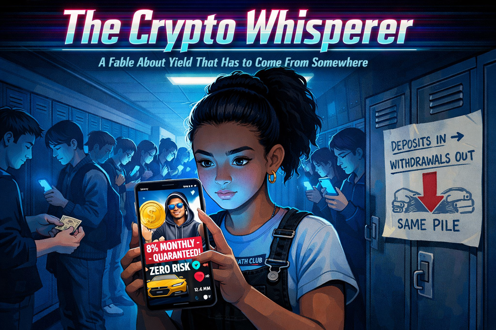
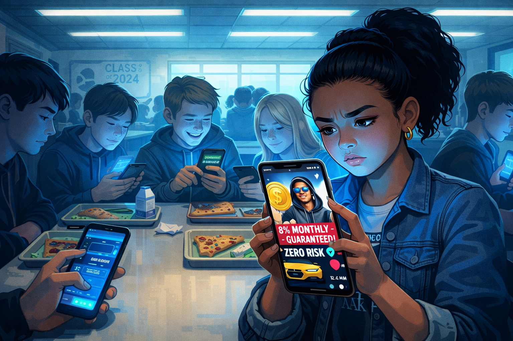
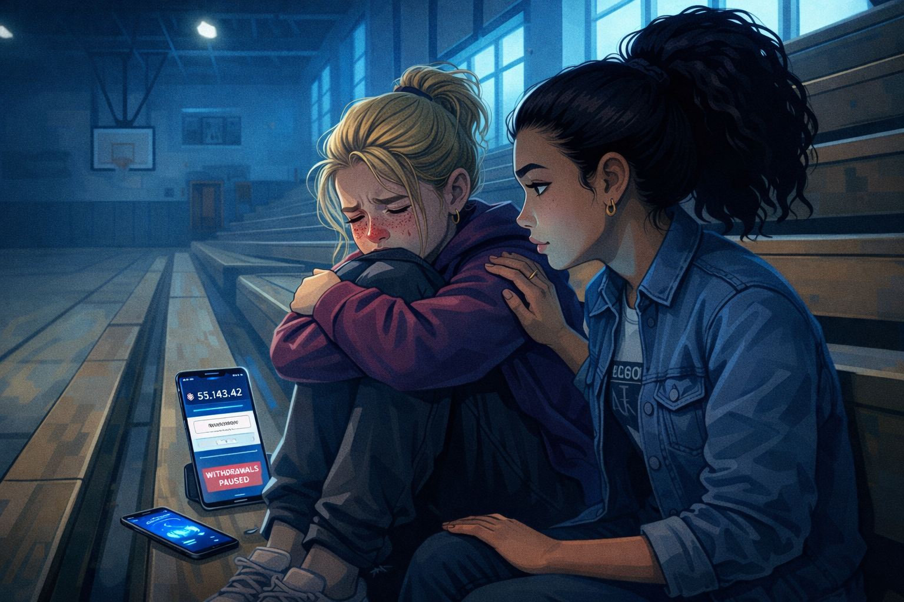
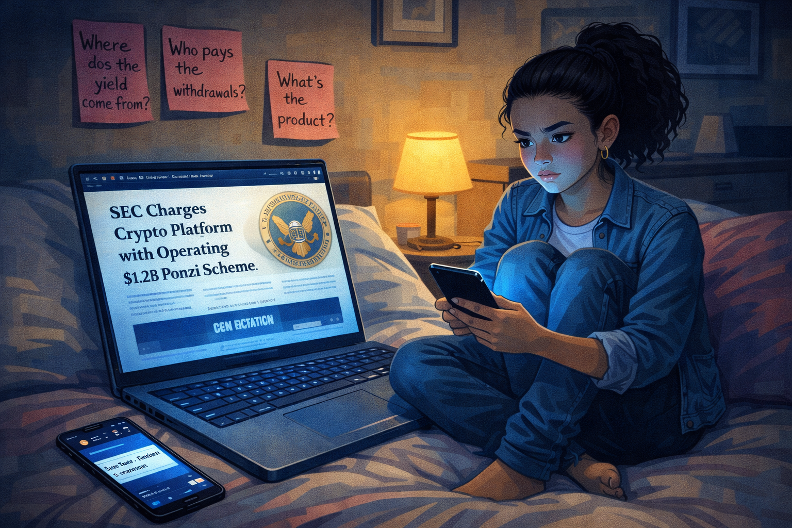
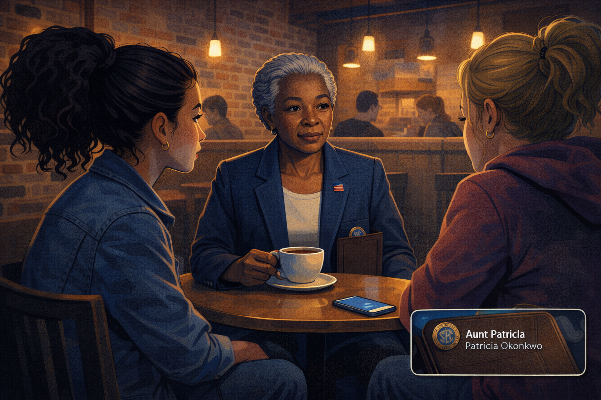
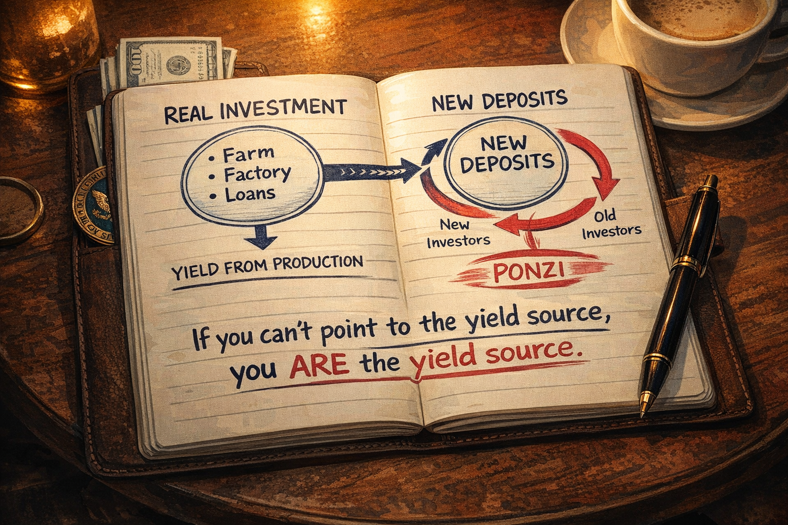
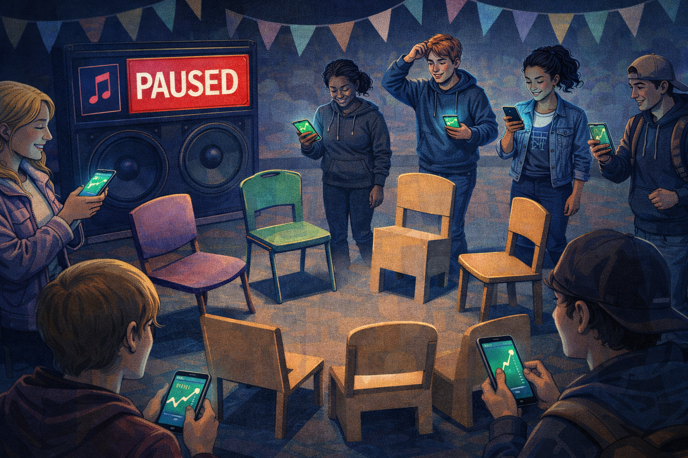
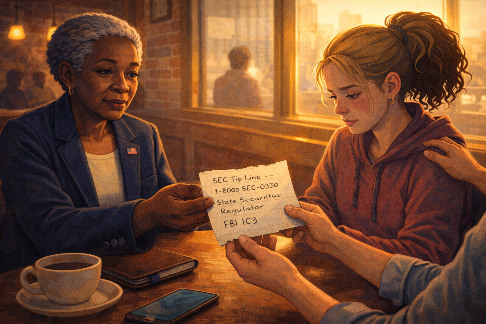

# The Crypto Whisperer: How 8% a Month Turns Savers Into Fuel

Cover Image Prompt

Create a 16:9 contemporary illustrated cover image in a graphic-novel style. In the foreground, a teenage girl named Maya holds her phone showing a TikTok video of a charismatic young man in a hoodie with sunglasses pointing at a gold-colored cartoon coin labeled "LUXOR." Over his head float bold text overlays: "8% MONTHLY GUARANTEED." Behind Maya, a crowded high school hallway shows classmates scrolling the same video, faces lit by screen blue. In the distance, almost hidden in shadow, a simple diagram labeled "Deposits In → Withdrawals Out — Same Pile" hints at the truth. Palette: screen-glow blue, gold coin accents, neon pink TikTok highlights, warm skin tones, a single red alert dot. Mood: hype meets unease, compelling and slightly sinister. Style: contemporary graphic-novel with social-media overlay aesthetic. Generate the image immediately without asking clarifying questions.

## A Coin on Everyone's For-You Page

In the spring of her sophomore year, Maya Chen noticed that every phone at lunch was showing the same face. His name was Cipher Knox. He was twenty-six, lived in Miami, wore a hoodie that cost more than most cars, and posted three videos a day about a new token called LUXOR. His pitch was short and catchy.

*"Stake LUXOR in my protocol. Eight percent returns. Per month. Compounding. This is what the banks don't want you to know."*

Maya was in the math club. She ran the numbers on her notebook the first time she saw the video. Eight percent a month, compounded, was about 150% annualized. A ten thousand dollar deposit would become twenty-five thousand dollars in a year. The S&P 500 averaged about ten percent a year. LUXOR was claiming roughly fifteen times the return of the entire American stock market.

At lunch the next day her friend Brittany said she had just put her entire lifeguarding savings — thirty-two hundred dollars — into LUXOR. *"I already made four hundred in three weeks,"* Brittany said. *"You're missing out."*

Image Prompt

Create a 16:9 contemporary illustrated panel. A high school cafeteria at lunch, long tables and fluorescent lighting. In the foreground, Maya, 16, Asian American, wearing a denim jacket over a math-club t-shirt, holds her phone and watches a TikTok video on the screen with a skeptical furrow. Around her, four classmates at the same table stare at their own phones, faces lit by the same blue screen, all showing the same pitchman. One classmate is tapping excitedly at an investing app. Cafeteria details: plastic trays, pizza slices, a cafeteria poster about graduation. Palette: fluorescent cafeteria whites, blue screen glow, warm Asian-American skin tones, pop of neon pink TikTok. Mood: the moment skepticism meets peer pressure. Style: contemporary graphic-novel with social-media overlay aesthetic. Generate the image immediately without asking clarifying questions.

## Brittany Stops Being Brittany

Three weeks later, on a Tuesday, Brittany wasn't in homeroom. She wasn't there Wednesday either. On Thursday Maya found her sitting alone on the gym bleachers with her knees pulled up to her chest, her phone face-up on the bench beside her. The LUXOR app was open. The "Withdraw" button had a gray banner across it reading *"Withdrawals paused due to extraordinary network conditions."*

Brittany had put in thirty-two hundred dollars. She had borrowed fifteen hundred more from her older brother because the returns looked too good to pass up. Her app balance now said $6,847, but she couldn't get any of it out. She hadn't slept since Monday. Her hands were shaking slightly. When Maya sat down, Brittany started to cry and couldn't stop for a long time.

*"I can't tell my parents,"* she whispered. *"I told my brother I'd double his money. I told him."*

Maya sat with her for the rest of the period. She didn't know what to say. But she knew she had to find someone who did.

Image Prompt

Create a 16:9 contemporary illustrated panel. An empty high school gymnasium's bleachers mid-afternoon. Brittany, 16, blonde hair pulled back in a messy bun, curled up on the wooden bleachers with her arms around her knees, face red from crying. Her phone rests beside her, screen visible: a crypto app showing a large balance with a grayed-out "WITHDRAW" button and a banner reading "WITHDRAWALS PAUSED." Maya sits beside her with a hand gently on Brittany's shoulder, looking worried. High gym windows let in cold blue afternoon light. Palette: cool gym blues and grays, muted wood of bleachers, the sharp blue phone screen, a single splash of warm skin tone. Mood: quiet panic, isolation, a friend showing up. Style: graphic-novel with emotional close-up framing. Generate the image immediately without asking clarifying questions.

## The First Skeptical Question

That night Maya could not stop thinking about one thing. If Cipher Knox had a magical eight-percent-a-month trading strategy, where was the money actually coming from? In a regular business, returns came from customers paying for a product or service. In a regular stock, returns came from earnings — the company actually made something people bought. In a bank savings account, the bank lent your money out at a higher rate and paid you a slice.

Maya texted her dad's old college roommate, who was a finance professor, and asked if he knew anyone who had actually investigated these things. He wrote back within an hour. *"My aunt retired two years ago from the Securities and Exchange Commission. She worked on crypto fraud cases for the last decade of her career. Want her number?"*

Maya wrote the number down carefully. Then she asked Brittany to meet her after school the following Saturday.

Image Prompt

Create a 16:9 contemporary illustrated panel. Maya's bedroom at night. She sits cross-legged on her bed with a laptop open to an article titled "SEC Charges Crypto Platform with Operating $1.2B Ponzi Scheme." Post-it notes stick to her wall with handwritten questions: "Where does the yield come from?" "Who pays the withdrawals?" "What's the product?" Her phone screen shows a text from her dad's friend with a contact labeled "Aunt Patricia — Retired SEC Examiner." Palette: bedroom warm yellows, laptop screen blue, pink Post-it accents. Mood: quiet investigation, the shape of a question forming. Style: graphic-novel with clear note-taking detail. Generate the image immediately without asking clarifying questions.

## Enter the Retired SEC Examiner

Patricia Okonkwo had spent twenty-eight years at the Securities and Exchange Commission. Her last decade had been in the Division of Enforcement's crypto asset unit, where she had worked on roughly forty enforcement actions against fraudulent tokens, unregistered yield platforms, and outright Ponzi schemes. She met Maya and Brittany at a coffee shop near the university. She wore a blazer, carried a leather notebook, and had the calm gravity of someone who had watched this exact movie dozens of times.

*"Tell me about LUXOR,"* she said.

Brittany, nervous, pulled out her phone and showed her the app. Patricia looked at the frozen withdrawal button, the promised returns, the glossy white paper, and the founder's TikTok. Her expression did not change.

*"I've seen this same product forty times,"* she said quietly. *"Different names. Same product. Let me show you what you actually bought."*

Image Prompt

Create a 16:9 contemporary illustrated panel. A warm coffee shop with exposed brick and pendant lights. Patricia Okonkwo, late 60s, Black, silver hair in a neat natural style, wearing a navy blazer with a small American flag pin, sits at a small round table with a leather notebook and a cup of coffee. Maya and Brittany sit across from her. Patricia's expression is calm, serious, grounded. An SEC challenge coin peeks from her notebook pocket as a subtle credential marker. Palette: warm coffee shop amber, deep navy blazer, rich browns, the pale blue of Brittany's phone on the table. Mood: the arrival of a grown-up who has seen all of this before. Style: contemporary graphic-novel, cinematic framing. Generate the image immediately without asking clarifying questions.

## Where the Money Actually Comes From

Patricia opened her leather notebook and drew two circles.

*"A real investment produces a return because something productive happens. A farm grows corn. A factory builds cars. A bank lends money to borrowers who pay interest. In every case, there is a source of yield — a real economic activity somewhere — and the investor receives a slice of what that activity produced. If I can't point to that activity, I'm not looking at an investment."*

She turned the page and drew a third circle, and inside it wrote *"new deposits."*

*"A Ponzi scheme does not produce yield. It moves yield. Old investors are paid with new investors' money. As long as deposits grow faster than withdrawals, the scheme looks like a genius trading strategy. As soon as deposits slow, the scheme collapses — because there was never anything underneath."*

She wrote numbers next to the circle. *"Let's say the platform has ten thousand users, and the average deposit is two thousand dollars. That's twenty million dollars of cash sitting with the operator. If one thousand users ask to withdraw their 'profits' — say, ten percent of the balance, two million dollars — the operator can easily pay them out of the other eighteen million dollars still sitting there. The withdrawals look real. The yield looks real. But no yield was generated. Only deposits were moved."*

*"The second month,"* Patricia continued, *"the operator needs new deposits to pay the next round. The third month, more. The fourth. By month six or seven, the incoming deposits finally can't keep up with the outgoing withdrawals. The operator pauses withdrawals — 'extraordinary network conditions,' 'upgrade in progress,' 'regulatory review' — and the collapse has begun. The last people in lose everything. The first people out sometimes get their deposit back plus a little. The operator usually has a plane ticket."*

Brittany stared at her frozen withdrawal button.

Image Prompt

Create a 16:9 contemporary illustrated panel. A close-up on Patricia's open leather notebook. Two small circles on the left labeled "REAL INVESTMENT → Farm / Factory / Loans" with an arrow out labeled "YIELD FROM PRODUCTION." On the right, a single large circle labeled "NEW DEPOSITS" with a recycling-style arrow that curves back into itself, showing money flowing from new investors to old investors without any production step. Written at the bottom in bold: "If you can't point to the yield source, you ARE the yield source." Patricia's pen rests on the page. Palette: cream notebook paper, navy ink, a touch of warning red on the Ponzi arrow, coffee-shop warm light. Mood: the diagram that will stay with the reader. Style: graphic-novel infographic hybrid. Generate the image immediately without asking clarifying questions.

## The Musical Chairs Analogy

Maya traced the Ponzi diagram with her finger. Something was clicking.

*"So it's like musical chairs,"* she said slowly. *"As long as people keep joining the circle and the music keeps playing, everyone thinks they have a seat. The moment the music stops, whoever is standing loses everything, and the chairs were never really there to begin with."*

Patricia smiled for the first time. *"Exactly. And in a real Ponzi the music is the growth rate of new deposits. As long as more money comes in than goes out, the operator can pay whoever asks. When new deposits slow — usually because the hype cycle cools, or a regulator sends a subpoena, or a competing scheme sucks attention away — the music stops and the withdrawals pause. The gray banner Brittany is looking at? That is the sound of the music ending."*

*"The 8% a month wasn't a return,"* Maya said. *"It was a recruitment tool."*

*"Yes. The high advertised yield exists to pull in new deposits fast. The faster deposits come in, the longer the operator can keep paying the early investors, which makes the early investors post screenshots, which pulls in more new deposits. Cipher Knox is not a trader. He is a marketer. His product is urgency."*

Image Prompt

Create a 16:9 contemporary illustrated panel using a musical-chairs visual metaphor. A circle of mismatched chairs on a stage with cheerful children's-birthday-party bunting, but the lighting is cold and wrong. Happy participants circle the chairs, each holding a phone showing green upward charts. One participant has just been caught standing as the music icon on a speaker cuts off — a big red "PAUSED" overlay. The empty space between the chairs reveals, on closer look, that half the chairs are cardboard cutouts. Palette: circus pastels twisted slightly cold, warning red for the paused speaker, screen-glow on the phones. Mood: the sharp clarity of a metaphor snapping into place. Style: graphic-novel with slight surreal edge. Generate the image immediately without asking clarifying questions.

## The Cost of a Frozen Button

Patricia closed her notebook. Her voice softened.

*"I've interviewed more than a hundred victims of yield schemes over my career. The money is part of the story, but it is never the whole story. I've talked to people who stopped going to work because they couldn't face colleagues they had recruited into the scheme. I've talked to a father who couldn't eat for eight weeks after he lost the down payment for a house. I've talked to a college student who stopped answering her phone because she couldn't face the friends whose money she had pulled in."*

*"Brittany,"* Patricia said gently, turning to her, *"you are going to feel panic for a while. You are going to feel shame. Those feelings are not your fault. The operator chose them for you the day he designed the product. The panic is the cost he priced in. The shame is the reason he knows you won't report it. I want you to report it anyway."*

Brittany nodded, tears on her cheeks. Patricia wrote down the SEC tip line, the state securities regulator's contact, and a link to the FBI's IC3 complaint portal on a clean page of her notebook and tore it out.

*"The money might not come back. But your voice adds to the evidence, and evidence is how these operators eventually get caught. Your classmates will thank you."*

Image Prompt

Create a 16:9 contemporary illustrated panel. A softly lit moment in the coffee shop as the conversation ends. Patricia hands Brittany a torn page from her leather notebook with three handwritten lines: "SEC Tip Line — 1-800-SEC-0330," "State Securities Regulator," "FBI IC3." Brittany, eyes red but face a little steadier, takes the paper with both hands. Maya, beside her, has a hand on Brittany's back. Through the coffee shop window, late afternoon sunlight spills across the table. Palette: warm golden-hour light, rich browns, paper cream, the navy of Patricia's blazer. Mood: grief settling, but also the first step back toward dignity. Style: graphic-novel with soft cinematic warmth. Generate the image immediately without asking clarifying questions.

## The Moral of the Story

Three weeks later, LUXOR's founder disappeared. The app went dark. A federal complaint was eventually filed naming Cipher Knox and two co-conspirators on charges of securities fraud and wire fraud. Brittany lost most of her savings and paid her brother back slowly out of her summer paychecks. She also became the first student in Maya's school to speak to an assembly about crypto scams. Her voice shook the first time. It shook a little less the second.

Three lessons clicked into place:

1. Every real return has a real source: a farm, a factory, a loan, a business. If you can't name the productive activity that produces the yield, the yield isn't being produced — it is being moved from someone else's deposit to yours, and someday you will be the someone else.
2. Advertised returns that dwarf the market are not a sign of genius; they are a sign of recruitment. An 8%-per-month scheme is roughly 150% per year — about fifteen times the long-run return of the U.S. stock market. That gap is the price of your skepticism being turned off.
3. When withdrawals pause, the scheme is already over. The frozen button is not a temporary inconvenience. It is the music stopping in musical chairs.

The next time Maya scrolled past a flashy young founder promising extraordinary monthly returns, she planned to ask one question before she asked any other: *"Where is the return actually coming from?"* If the answer was vague, technical, or circled back to "new investors," she would keep scrolling. If you can't explain the yield source, you're the yield.

And that, dear reader, is how a sophomore with a notebook and a good question protects herself from a trap that catches people three times her age.

## References

1. U.S. Securities and Exchange Commission. (2023). *Crypto Assets and Cyber Enforcement Actions*. A continuously updated public database of SEC enforcement actions against crypto platforms, including detailed complaints describing yield-promise Ponzi mechanics. [https://www.sec.gov/spotlight/cybersecurity-enforcement-actions](https://www.sec.gov/spotlight/cybersecurity-enforcement-actions)

2. U.S. Securities and Exchange Commission, Office of Investor Education and Advocacy. (2022). *Investor Alert: Ponzi Schemes Using Virtual Currencies*. Plain-language description of how crypto Ponzi schemes pay early investors with later investors' deposits, and the warning signs (guaranteed returns, unlicensed sellers, withdrawal delays). [https://www.sec.gov/oiea/investor-alerts-and-bulletins](https://www.sec.gov/oiea/investor-alerts-and-bulletins)

3. Federal Trade Commission. (2023). *Consumer Sentinel Network Data Book*. Annual report tracking fraud complaints, including cryptocurrency investment scams, with documented median losses and demographic trends. [https://www.ftc.gov/reports/consumer-sentinel-network-data-book-2023](https://www.ftc.gov/reports/consumer-sentinel-network-data-book-2023)

4. Federal Bureau of Investigation, Internet Crime Complaint Center (IC3). (2024). *Annual Internet Crime Report*. Documents billions of dollars in annual losses from cryptocurrency investment fraud, including "pig butchering" and yield-scheme typologies. [https://www.ic3.gov/Media/PDF/AnnualReport/](https://www.ic3.gov/Media/PDF/AnnualReport/)

5. Frankel, T. (2012). *The Ponzi Scheme Puzzle: A History and Analysis of Con Artists and Victims*. Oxford University Press. A comprehensive academic history of Ponzi-scheme mechanics from Charles Ponzi through Bernard Madoff, including the common structural features that apply directly to modern crypto yield platforms.

6. Gandal, N., Hamrick, J. T., Moore, T., & Oberman, T. (2018). Price Manipulation in the Bitcoin Ecosystem. *Journal of Monetary Economics*, 95, 86-96. Peer-reviewed analysis of manipulation and fraud patterns in cryptocurrency markets, demonstrating how opaque platforms can sustain price and yield illusions until liquidity collapses.
