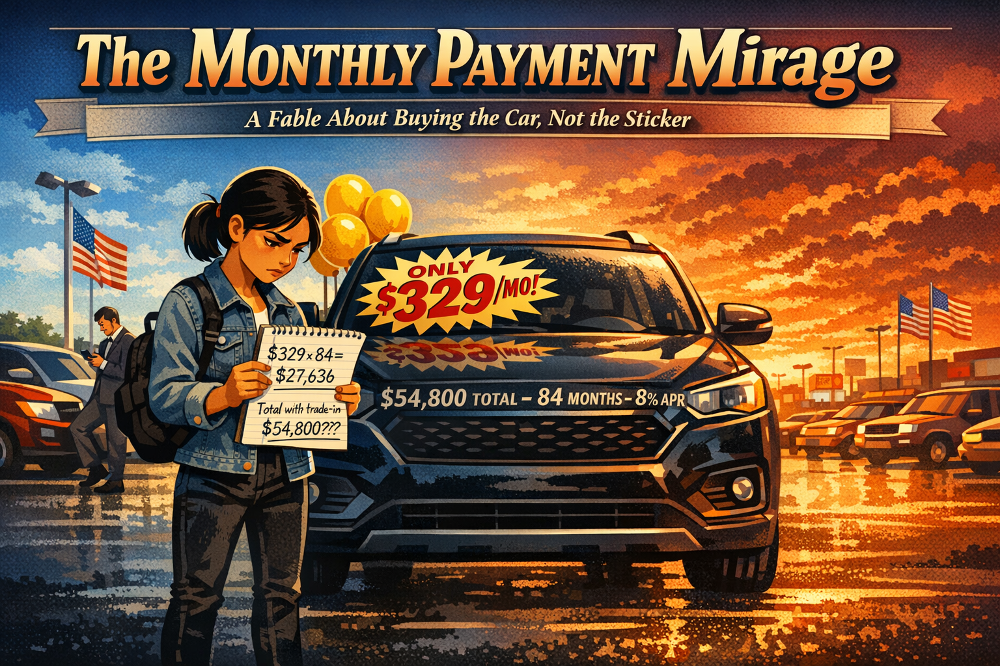
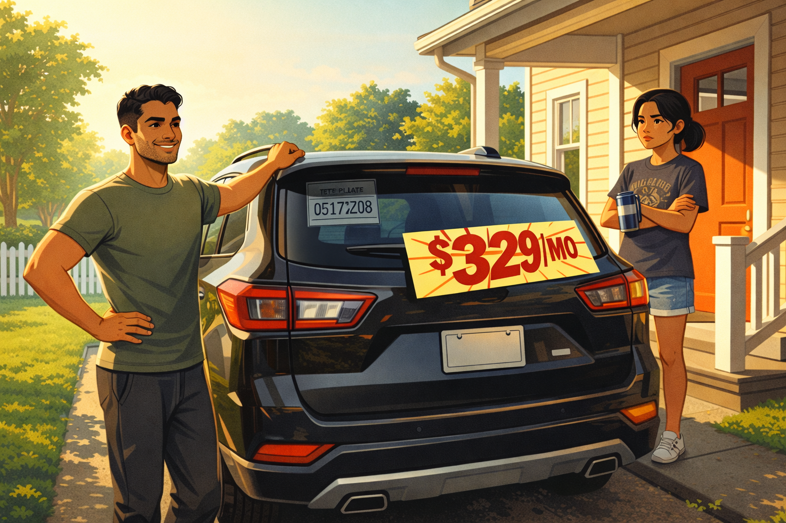
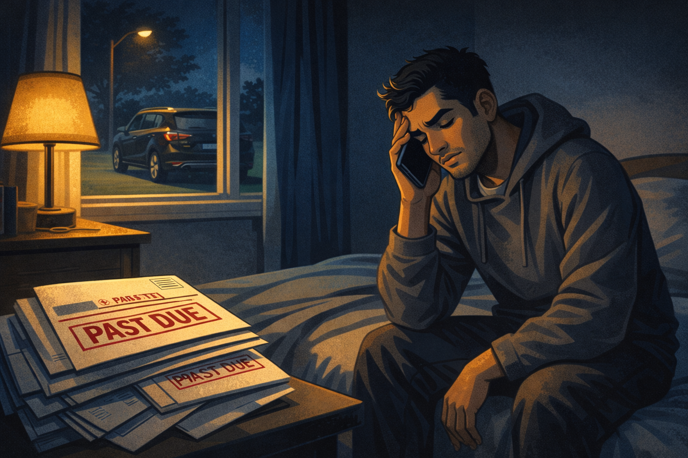
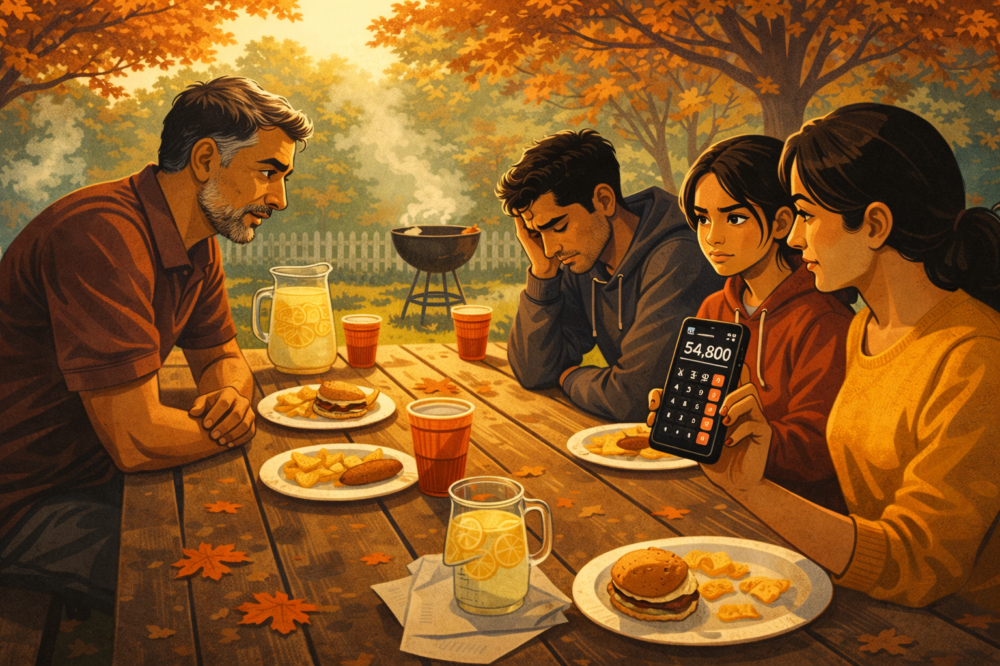
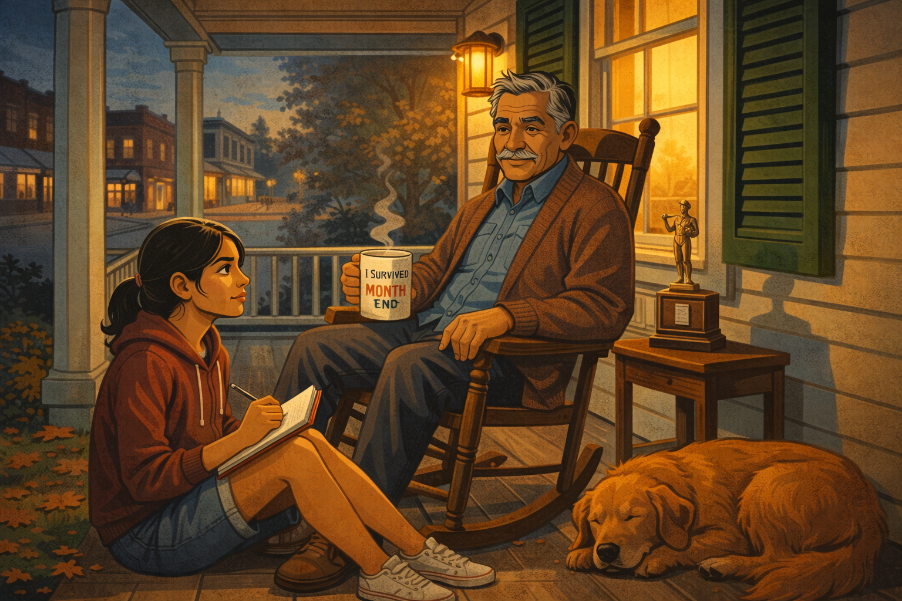
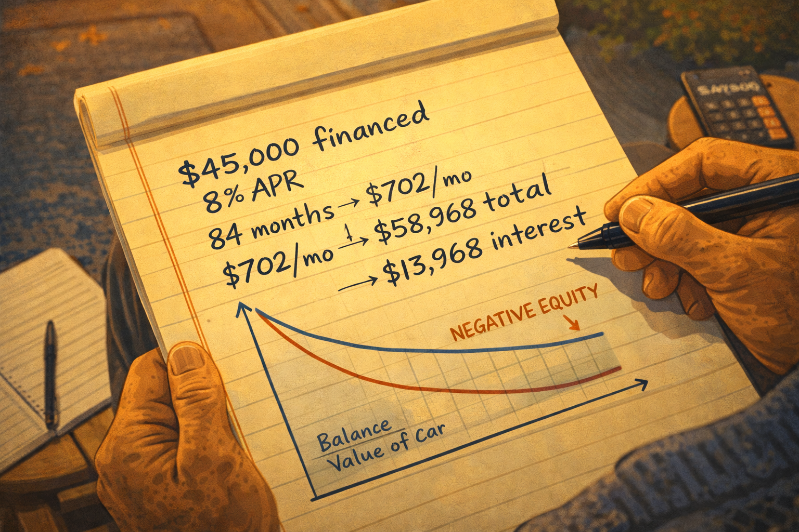
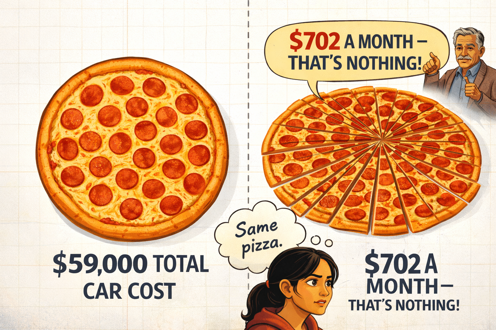
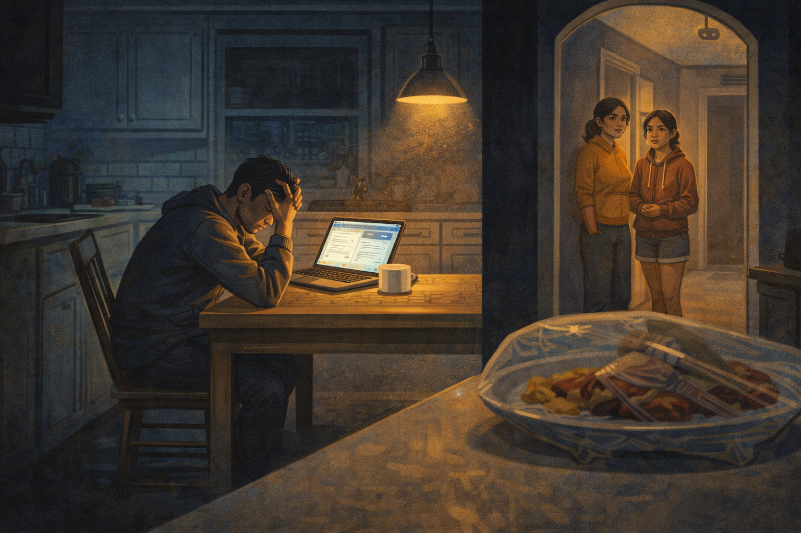

# The Monthly Payment Mirage: How Dealers Sell Payments Instead of Cars

Cover Image Prompt

At the top of the image, across the top 15% of the canvas, display the title "The Monthly Payment Mirage" in bold condensed serif typography with a cream-to-amber gradient fill and a charcoal drop shadow. Immediately beneath the title, a smaller italic subtitle in cream reads "A Fable About Buying the Car, Not the Sticker." Frame the title block with a faint horizontal ribbon banner.

Below the title area, render a 16:9 contemporary illustrated scene in a warm, cinematic graphic-novel style. Setting: a sun-drenched suburban American car dealership lot in late afternoon, with heat shimmer rising off the blacktop and distant strip-mall signage blurring on the horizon. In the foreground, Riya — a sixteen-year-old junior in a faded denim jacket, black jeans, white sneakers, and a small backpack slung over one shoulder — stands with her feet planted, holding a spiral steno notebook filled with her own handwriting: "$329 × 84 = $27,636" and "Total with trade-in: $54,800??" Her brow is furrowed with determination. Her dark hair is pulled back in a low ponytail.

Looming directly behind her is a gleaming black midsize SUV (generic, not a real brand), its windshield dominated by a giant starburst sticker reading "ONLY $329/MO!" in chunky red 1980s advertising typography, with yellow cartoon balloons tied to the side mirror. Faintly overlaid in ghosted chrome lettering across the hood, as if only Riya can see it: "$54,800 TOTAL — 84 MONTHS — 8% APR."

Midground: a bored salesperson in a gray suit leans against another car scrolling his phone. A row of pickups and sedans recedes into perspective. American flags on tall poles snap in a light breeze.

Background: the sky is split — hopeful cobalt blue on the left, warning orange-crimson sunset on the right, bleeding into violet at the seam.

Color palette: warm oranges and deep navy dominate, chrome silver accents on cars, cautionary red for the sticker, cream highlights on the title. Mood: cinematic, slightly ominous, educational — like a Pixar short crossed with a Dust Bowl WPA poster. Style: flat vector illustration with soft airbrushed shading and faint halftone texture.

Generate the image immediately without asking clarifying questions.

## A Shiny New SUV in the Driveway

On a Saturday morning in late August, Riya Patel heard her older brother Arjun honking from the driveway. She pulled back her bedroom curtain and saw a gleaming black SUV with temporary tags and a dealer sticker still in the window. Arjun was grinning wider than she'd seen him grin all summer.

Riya was seventeen, a junior, and worked twelve hours a week scooping ice cream at the mall. She had just finished a personal finance unit where her teacher made the class calculate APR and total interest by hand. The numbers had felt abstract in class. Out in the driveway, they were about to get very real.

"Three twenty-nine a month," Arjun said when she came outside. "That's less than I pay for my phone and my gym membership combined. Easy."

Image Prompt

(This is panel 1. Do not put the panel number in the image.) Create a 16:9 contemporary illustrated panel. A bright Saturday morning in a suburban American driveway. A 22-year-old man named Arjun, South Asian, in a fitted t-shirt and joggers, stands proudly next to a glossy new black SUV with temporary paper tags. His teenage sister Riya, 17, in shorts and a faded band t-shirt, stands on the front porch with her arms crossed and an unconvinced expression, holding a thermos of coffee. A dealer window sticker still says "$329/MO" in big red numerals. Green lawn, white picket fence, late summer light. Palette: warm morning yellows, deep green lawn, glossy black SUV, bright red price sticker. Mood: hopeful yet quietly tense. Style: clean graphic-novel illustration with soft shading. Generate the image immediately without asking clarifying questions.

## Something Isn't Right With Arjun

Two months passed. The SUV stopped being the center of family conversation, and Arjun stopped being the center of family dinners. He skipped Sunday pasta night three weeks in a row. When he did show up, he ate fast, checked his phone constantly, and flinched every time a notification chimed.

One night Riya walked past his room and heard him on the phone with someone from a bank. His voice was low and tight. *"I know it's past due. I'm trying. Can I split it across two paychecks?"* He hadn't slept well in weeks; his eyes had dark half-moons under them. He snapped at their mom over a question about Thanksgiving. Their mom didn't say anything, but later Riya saw her crying quietly in the kitchen.

Riya recognized the look on her brother's face. It was the look of someone who had stopped opening his mail.

Image Prompt

(This is panel 2. Do not put the panel number in the image.) Create a 16:9 contemporary illustrated panel showing quiet financial stress. A dimly lit bedroom at night. Arjun, the 22-year-old brother, sits on the edge of his bed in a rumpled hoodie, phone pressed to his ear, free hand rubbing his temple. A stack of unopened envelopes with red "PAST DUE" markings sits on his desk. Out the window, the black SUV glows under a streetlight like a trophy that has turned into a weight. Palette: cool blue shadows, harsh yellow lamplight, muted reds on the envelopes. Mood: lonely, anxious, exhausted. Style: graphic-novel with heavy ambient shadow. Generate the image immediately without asking clarifying questions.

## The First Skeptical Question

At a family cookout on Columbus Day weekend, Arjun finally admitted that the SUV was "tight but fine." Their uncle Ravi, a no-nonsense engineer, put down his burger.

*"How much did it cost, total?"* Ravi asked.

*"Three twenty-nine a month,"* Arjun said again, like a line he had rehearsed.

*"That's not what I asked,"* Ravi said gently. *"What's the sticker? What's the loan? How many months?"*

Arjun's jaw tightened. He didn't know the sticker. He thought the loan was "around forty-something." He was pretty sure the term was seven years, "maybe eight, I'd have to check."

Riya watched her brother's face and thought about her teacher's definition of APR. Then she asked the question that would stick with her for the rest of her life.

*"Arjun, what's the total cost if you pay every payment on time?"*

The cookout got quiet. Arjun didn't know.

Image Prompt

(This is panel 3. Do not put the panel number in the image.) Create a 16:9 contemporary illustrated panel of a backyard family cookout in autumn. A wooden picnic table with paper plates, a half-eaten burger, and a pitcher of lemonade. Uncle Ravi, 50s, South Asian, in a polo shirt, leans across the table with a serious but kind expression. Arjun looks down at his plate, shoulders hunched. Riya, sitting next to her mom, holds up a phone calculator with a thoughtful frown. Orange maple leaves scatter the grass; a charcoal grill smokes softly in the background. Palette: warm autumn golds, deep reds, muted greens. Mood: gentle confrontation, family concern, clarity dawning. Style: contemporary graphic-novel illustration. Generate the image immediately without asking clarifying questions.

## Enter the Retired Finance Manager

That Monday, Riya asked her uncle if he knew anyone who could actually explain car loans. Ravi made a phone call and drove her to a small house on the edge of town. On the porch sat Mr. Frank Delgado, a retired dealership finance manager who had spent thirty-one years writing car loans at a Ford store, a Chevy store, and finally a high-volume import dealer. He had a silver mustache, a mug that said *I Survived Month-End*, and the patient voice of someone who had explained amortization schedules a thousand times.

*"Tell me the numbers,"* Frank said. Riya read them off her phone. Arjun had eventually confessed. Forty-five thousand dollars financed. Eight percent APR. Eighty-four months. Three hundred and twenty-nine dollars wasn't even right; the real payment was seven hundred and two. The $329 had been the lease-style teaser in a separate ad. Arjun had signed a loan, not a lease.

Frank nodded slowly. *"That's the oldest card in the deck,"* he said. *"Let me show you what he actually bought."*

Image Prompt

(This is panel 4. Do not put the panel number in the image.) Create a 16:9 contemporary illustrated panel of a cozy covered porch in a small American town. Frank Delgado, late 60s, Latino, silver mustache, wearing a cardigan over a denim shirt, sits in a rocking chair with a steaming coffee mug reading "I Survived Month-End." A golden retriever sleeps at his feet. Riya sits on the porch step with a notebook, pen poised. An old dealership sales trophy sits on a side table beside him as a subtle hint of his past life. Palette: warm porch-lamp yellows, deep green shutters, earthy browns. Mood: wise, welcoming, patient. Style: graphic-novel illustration with gentle warmth. Generate the image immediately without asking clarifying questions.

## The Math Behind the Mirage

Frank pulled a yellow legal pad from a side table and began to write.

*"A car loan has three levers,"* he said. *"Price, rate, and term. Dealers lean on term because stretching the term is the only way to make an expensive car feel cheap. Your brother financed forty-five thousand dollars at eight percent for eighty-four months. His payment is about seven hundred and two dollars. Over eighty-four months, that's fifty-eight thousand nine hundred and sixty-eight dollars paid to the bank. The interest alone is about thirteen thousand nine hundred and sixty-eight dollars."*

He wrote the numbers out one at a time so Riya could see them.

*"Now watch the trap close. On a seven-year loan, the car loses value much faster than he pays down the balance. For roughly the first four years of that loan, he owes more on the SUV than the SUV is worth. We call that being upside-down, or having negative equity. If his transmission blows, if he crashes, if he loses his job and has to sell — the bank still wants its money, and the car won't cover it."*

*"And here's the part the showroom never mentions,"* Frank continued. *"When he trades this SUV in three years from now because he's tired of it, the dealer will roll what he still owes into the next loan. That's how people end up financing eighty thousand dollars on a sixty thousand dollar truck."*

Image Prompt

(This is panel 5. Do not put the panel number in the image.) Create a 16:9 contemporary illustrated panel. A close-up on Frank's yellow legal pad, tilted for the viewer. Handwritten in clear pen strokes: "$45,000 financed, 8% APR, 84 months → $702/mo → $58,968 total → $13,968 interest." A simple amortization curve shows the balance (blue) descending slowly while the car's value (red) plummets faster, with the gap labeled "NEGATIVE EQUITY." Frank's weathered hand holds the pen; Riya's notebook and phone calculator are just visible at the edge. Palette: cream paper, navy ink, red accent, soft porch light. Mood: revealing, calm, illuminating. Style: graphic-novel with a slight documentary feel. Generate the image immediately without asking clarifying questions.

## The Pizza Analogy

Riya stared at the numbers. Something was clicking.

*"So it's like ordering a pizza and only asking how much each slice costs,"* she said slowly. *"If I stretch the same pizza across enough slices, any slice can sound cheap. But the pizza is still the same pizza."*

Frank laughed for the first time that afternoon. *"Exactly. And the dealer has every reason to keep you looking at the slice. If I told a customer 'the pizza is fifty-nine thousand dollars,' they'd walk out. If I told them 'it's only seven hundred a month,' they'd sign. Same pizza. Different frame."*

*"They weren't selling him a car,"* Riya said. *"They were selling him a payment."*

*"Now you see it,"* Frank said. *"A dealer's finance office doesn't make most of its money on the car. They make it on the loan, the extended warranty, the gap insurance, the paint protection, the tire-and-wheel plan. Every one of those is priced as a small addition to a monthly number. Thirty dollars a month sounds like nothing. Thirty dollars a month for eighty-four months is twenty-five hundred and twenty dollars."*

Image Prompt

(This is panel 6. Do not put the panel number in the image.) Create a 16:9 contemporary illustrated panel. A split visual metaphor: on the left, a whole large pepperoni pizza labeled "$59,000 TOTAL CAR COST." On the right, the same pizza sliced into 84 tiny wedges, each labeled "$702 A MONTH — THAT'S NOTHING!" A thought bubble from Riya reads "Same pizza." Frank in the background gestures approvingly. Palette: warm pizza reds and cheese yellows against a clean white illustration background with subtle grid lines. Mood: clarity, gentle humor, the "aha" beat. Style: graphic-novel with infographic overlay. Generate the image immediately without asking clarifying questions.

## The Cost Nobody Puts on the Sticker

As the sun dropped behind the oak trees, Riya asked one more question. *"Mr. Delgado, my brother looks terrible. He doesn't sleep. He snaps at our mom. Is that normal for people in this situation?"*

Frank's smile faded. *"It's the part of the job I hated most,"* he said. *"Customers would come back six months later asking if they could refinance, or trade down, or sometimes just give the car back. I could hear it in their voices before they even said it. They were behind on groceries. They were fighting with their spouses. They'd stopped inviting people over because the car payment had eaten the budget that used to pay for dinner parties."*

*"The payment didn't just cost him money,"* Riya said. *"It cost him sleep. It cost my mom her peace of mind. It cost us family dinners."*

*"Car dealerships don't put that on the sticker,"* Frank said quietly. *"But it's on every loan. The longer the term, the heavier it gets, because you're married to a machine that depreciates faster than you can pay it off."*

Image Prompt

(This is panel 7. Do not put the panel number in the image.) Create a 16:9 contemporary illustrated panel showing the human cost of debt. A kitchen table at night, viewed from across the room. Arjun sits alone under a single pendant lamp with his head in his hands, a laptop showing a bank website in front of him. Through an archway, Riya and her mother are visible in the hallway, looking toward him with quiet concern, not intruding. On the kitchen counter sits an uneaten plate of food covered in plastic wrap. Palette: deep blue shadows, warm amber lamp glow, muted kitchen tones. Mood: tender, sobering, the story's emotional center. Style: cinematic graphic-novel illustration. Generate the image immediately without asking clarifying questions.

## The Moral of the Story

As Riya drove home with her uncle that evening, the math and the memory of her brother's face fused into one simple idea. A low monthly payment is a story the dealer tells you. The total cost is the truth the loan tells you. If she ever walked onto a lot in her own life, she would ignore the first number and chase the second.

Three lessons clicked into place:

1. A monthly payment is a slice; the total cost is the whole pizza. Ask how much the pizza costs before you argue about slices.
2. Long loan terms hide how much you're paying in interest and keep you upside-down on the car for years. If you can't afford the car on a four or five year loan, you can't afford the car.
3. Negative equity follows you. When a dealer offers to "take care of what you still owe" on a trade-in, they're rolling your old problem into your new one.

The next time Riya heard the words *"only a few hundred a month,"* she planned to answer with a quiet, steady question: *"What's the total cost if I pay every payment on time?"* That question would not save every friend. But it would save her.

And that, dear reader, is the difference between shopping for a car and shopping for a payment.

## References

1. Consumer Financial Protection Bureau. (2023). *Consumer Risks Posed by Auto Loans: Analysis of the Auto Loan Market*. CFPB research series documenting the growth in loan term length, the rise of negative equity at origination, and the relationship between longer terms and default risk. [https://www.consumerfinance.gov/data-research/research-reports/](https://www.consumerfinance.gov/data-research/research-reports/)

2. Federal Reserve Bank of New York. (2024). *Quarterly Report on Household Debt and Credit*. Tracks auto loan balances, delinquency rates, and the share of outstanding auto loans with terms of 72 months or longer. [https://www.newyorkfed.org/microeconomics/hhdc](https://www.newyorkfed.org/microeconomics/hhdc)

3. Federal Trade Commission. (2022). *Motor Vehicle Dealers Trade Regulation Rule (CARS Rule) — Proposed and Final Rule Materials*. Background materials describe specific dealership practices, including add-on product bundling and monthly-payment framing, that the rule was designed to address. [https://www.ftc.gov/legal-library/browse/federal-register-notices/motor-vehicle-dealers-trade-regulation-rule](https://www.ftc.gov/legal-library/browse/federal-register-notices/motor-vehicle-dealers-trade-regulation-rule)

4. Consumer Reports. (2021). *The Hidden Costs of a Long Car Loan*. Investigative reporting on how 72- and 84-month auto loans correlate with negative equity, repossession, and rolled-over debt in subsequent vehicle purchases. [https://www.consumerreports.org/car-financing/](https://www.consumerreports.org/car-financing/)

5. Argyle, B., Nadauld, T., & Palmer, C. (2020). Monthly Payment Targeting and the Demand for Maturity. *The Review of Financial Studies*, 33(11), 5416-5462. Peer-reviewed evidence that auto-loan borrowers anchor on monthly payments rather than total loan cost, and that dealers exploit this framing by extending loan terms.

6. National Automobile Dealers Association (NADA). (2024). *NADA Data Annual Financial Profile of America's Franchised New-Car Dealerships*. Industry-published figures showing that dealership finance and insurance (F&I) departments generate a disproportionate share of per-vehicle gross profit relative to the vehicle sale itself. [https://www.nada.org/nada/nada-data](https://www.nada.org/nada/nada-data)
